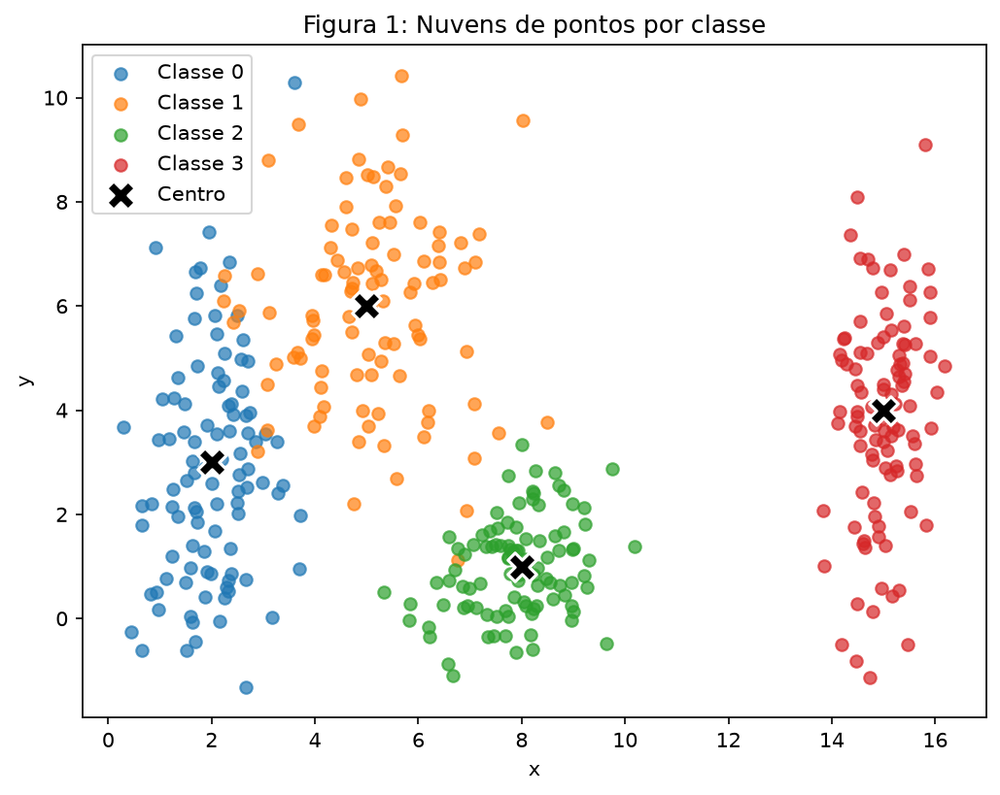
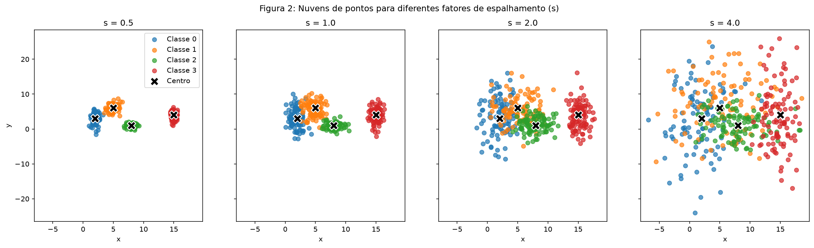
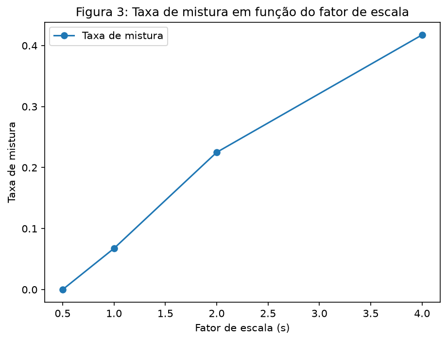
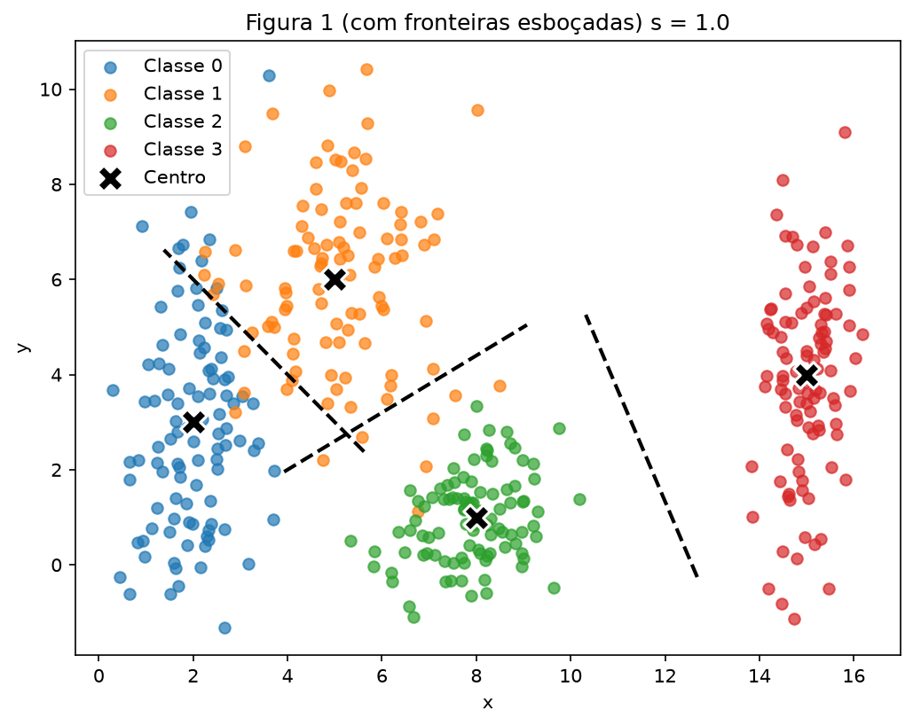
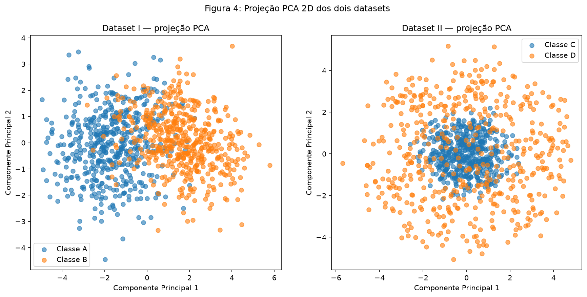
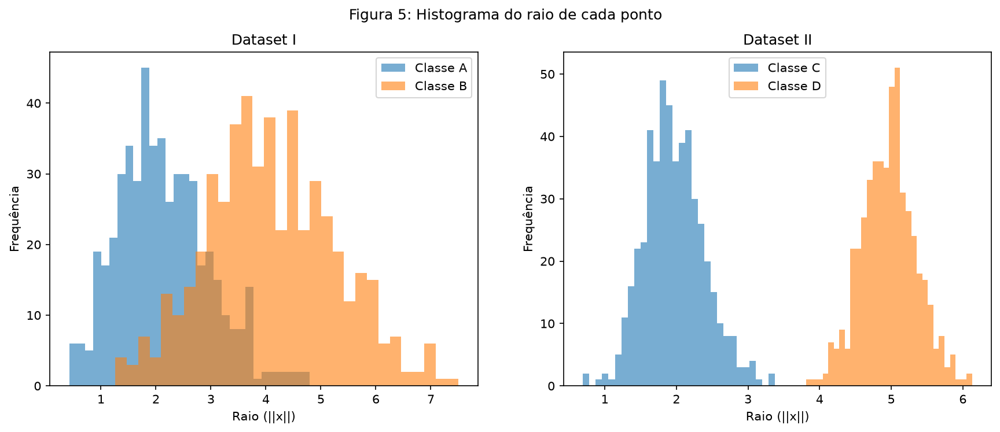
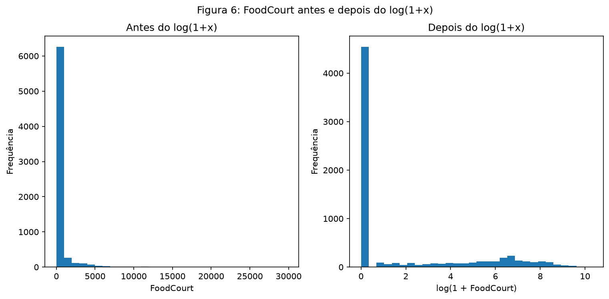

# Atividade: Preparação e Análise de Dados para Redes Neurais

!!! info "Uso de Inteligência Artificial"
    Utilizei o Claude como assistente de orientação ao longo deste exercício: ele explicou os conceitos envolvidos, revisou minha lógica e me ajudou a organizar o código e a estrutura do relatório. Toda a implementação, execução dos experimentos e interpretação dos resultados foi feita por mim.

!!! info "Método de resolução"
    Separei o desenvolvimento do exercício em três arquivos, o arquivo visto abaixo (index.md) e, para resolução organizada e detalhada, o arquivo (analysis.py) para o exercício 1 e 2, e o ex3.py para o 3, onde existe o passo a passo de todas as resoluções.

## **Ex 1: Nuvens de Pontos: Geometria e Espalhamento em 2D**

### A) Gerando os Dados

Foram geradas 400 amostras sintéticas 2D, divididas igualmente entre 4 classes com 100 amostras cada, segundo os parâmetros abaixo:

| Classe | Média (μ) | Desvio padrão (σ) |
|---|---|---|
| 0 | (2, 3) | (0.8, 2.5) |
| 1 | (5, 6) | (1.2, 1.9) |
| 2 | (8, 1) | (0.9, 0.9) |
| 3 | (15, 4) | (0.5, 2.0) |

A semente aleatória foi fixada com `rng = np.random.default_rng(42)`, como pedido anteriormente pelo professor.

```python
parametros = {
    0: {"centro": [2, 3],  "desv_pad": [0.8, 2.5]},
    1: {"centro": [5, 6],  "desv_pad": [1.2, 1.9]},
    2: {"centro": [8, 1],  "desv_pad": [0.9, 0.9]},
    3: {"centro": [15, 4], "desv_pad": [0.5, 2.0]},
}
n_por_classe = 100

nuvens = {}
for classe, p in parametros.items():
    nuvens[classe] = rng.normal(loc=p["centro"], scale=p["desv_pad"], size=(n_por_classe, 2))

X = np.vstack([nuvens[classe] for classe in parametros])
y = np.repeat(list(parametros.keys()), n_por_classe)
```



**Figura 1.** Distribuição das 400 amostras nas 4 classes, com o centro (média) de cada nuvem marcado em X preto.

### B) Análise de Espalhamento

As mesmas 4 classes foram regeneradas quatro vezes, multiplicando os desvios padrão originais por um fator de escala s = {0.5, 1.0, 2.0, 4.0}. Sendo que os centros permanecem fixos, apenas o espalhamento muda.

```python
scale_factors = [0.5, 1.0, 2.0, 4.0]

nuvens_por_s = {}
for s in scale_factors:
    nuvens_s = {}
    for classe, p in parametros.items():
        desv_pad_escalado = np.array(p["desv_pad"]) * s
        nuvens_s[classe] = rng.normal(loc=p["centro"], scale=desv_pad_escalado, size=(n_por_classe, 2))
    nuvens_por_s[s] = nuvens_s
```



**Figura 2.** Nuvens de pontos para s = 0.5, 1.0, 2.0 e 4.0, com os mesmos limites de eixo em todos os subplots.

A Figura 2 acima evidencia o comportamento da dispersão dos pontos segundo os diferentes fatores de escala aplicados em cima do desvio padrão, em que todas compartilham os mesmos limites nos eixos. Nessa figura é possível observar a importância no desvio padrão das amostras e como as nuvens de pontos se comportam e, com a presença de menores desvios padrões, é possível uma separação clara entre classes, enquanto quanto maior o fator de escala, maior a mistura entre classes.

Para a análise do espalhamento, foi feita a análise da razão de separação e taxa de mistura, podendo validar numericamente a distância entre nuvens e como são afetadas segundo uma mudança no fator de escala no desvio padrão. Lembrando que, quanto maior a razão de separação, mais distante estão as nuvens entre si.

**Razão de separação (s = 1)**

| Par (i, j) | r<sub>ij</sub> |
|---|---|
| (0, 1) | 1.326 |
| (0, 2) | 2.480 |
| (0, 3) | 4.496 |
| (1, 2) | 2.380 |
| (1, 3) | 3.642 |
| (2, 3) | 3.542 |

O par com menor razão de separação é **(0, 1)**, com r(0, 1) = 1.326. Como as médias não mudam com s e σ escala linearmente com s, temos r<sub>ij</sub>(s) = r<sub>ij</sub>(1) / s, logo, em s = 2, o menor r<sub>ij</sub> cai para **0.663**, calculado sem gerar novos dados, apenas com a relação vista.

**Taxa de mistura por fator de escala**

| s | Taxa de mistura |
|---|---|
| 0.5 | 0.000 |
| 1.0 | 0.068 |
| 2.0 | 0.225 |
| 4.0 | 0.417 |



**Figura 3.** A taxa de mistura cresce com o fator de escala s.

Observando a Figura 3, a taxa de mistura cresce discretamente até s = 1.0, mas dá um salto entre s = 1.0 e s = 2.0. É por volta desse ponto que as nuvens deixam de poder ser separadas por retas de forma confiável: na Figura 2, o painel de s = 2.0 já mostra sobreposição visível entre as classes 0, 1 e 2, enquanto nos painéis de s = 0.5 e s = 1.0 ainda dá pra imaginar fronteiras retas razoavelmente limpas entre as nuvens. É interessante ressaltar que ainda com o fator s = 2.0, é possível ter uma mínima distinção entre classes, onde seria possível separar com retas, tendo, em contra posição, muitos erros e pontos em classes erradas. Com s = 4.0 é praticamente impossível distiguir as classes.

Esse salto tem uma relação com a razão de separação r<sub>ij</sub>, calculada na tabela acima. Ela compara duas coisas que não crescem da mesma forma quando s aumenta:

- A distância entre os centros das classes (o numerador da fórmula): valor é fixo, porque as médias nunca mudam, não importa o s escolhido.
- A soma dos espalhamentos médios das duas classes (o denominador): esse valor cresce proporcionalmente a s, já que multiplicamos os desvios padrão originais por s.

Para o par mais próximo (classes 0 e 1): em s = 1, a distância entre os centros é 4.2 e a soma dos espalhamentos médios é 3.2, o que dá r₀₁ = 1.326. Como o numerador não muda com s, mas o denominador dobra quando s dobra, o valor de r₀₁ em s = 2 é simplesmente 1.326 / 2 = 0.663, sem precisar gerar nenhum dado novo (como já visto antes), só usando essa relação de proporcionalidade entre numerador fixo e denominador crescente.

O que esse número mostra: quando r<sub>ij</sub> > 1 (como em s = 1), a distância entre os centros ainda é maior que a soma dos espalhamentos, então ainda existe uma margem entre as duas nuvens. Quando r<sub>ij</sub> < 1 (como em s = 2, com 0.663), essa margem desaparece, o espalhamento combinado das duas classes já ultrapassa a distância entre seus centros, e elas passam a se sobrepor. É exatamente essa transição, o cruzamento de r<sub>ij</sub> pelo valor 1, entre s = 1 e s = 2, que correlaciona com o salto observado na taxa de mistura e a dificuldade de traçar retas para separar as classes.

### C) Análise e conclusões finais
1. No dataset original (s = 1), a Classe 3 está completamente isolada das demais, sem qualquer sobreposição. As Classes 0 e 1 apresentam uma sobreposição pequena visível na região entre seus centros. A Classe 2 permanece relativamente distinta das outras três. Uma única fronteira linear não seria suficiente para separar as 4 classes. Um conjunto de 3 fronteiras lineares, no entanto, consegue dividir o plano em regiões suficientes para separar as classes. Ainda assim, mesmo com as melhores retas possíveis, sempre restará algum erro residual na fronteira entre as Classes 0 e 1, já que suas distribuições se sobrepõem fisicamente naquela região.

2. Para desenhar um esboço razoável das fronteiras que uma rede neural treinada provavelmente aprenderia, usei a bissetriz perpendicular entre os centros de classes vizinhas, onde qualquer ponto está exatamente à mesma distância dos dois centros.
    ```python
    def bissetriz(p1, p2, comprimento=6):
        p1, p2 = np.array(p1), np.array(p2)
        meio = (p1 + p2) / 2
        direcao = p2 - p1
        perpendicular = np.array([-direcao[1], direcao[0]])
        perpendicular = perpendicular / np.linalg.norm(perpendicular)
        ponto_a = meio - perpendicular * comprimento / 2
        ponto_b = meio + perpendicular * comprimento / 2
        return ponto_a, ponto_b

    fronteiras = [(0, 1), (1, 2), (2, 3)]
    ```

    Desenhei a fronteira apenas entre classes vizinhas (0-1, 1-2 e 2-3). Usar todos os pares entre as classes 0, 1 e 2 faria as três linhas se cruzarem num único ponto, o que deixou o esboço visualmente confuso, em outro teste feito.

    

    **Figura 1 (com fronteiras esboçadas).** Linhas tracejadas mostrando uma aproximação das fronteiras de decisão que uma rede treinada poderia aprender entre as classes vizinhas.

    Como as classes têm espalhamentos ligeiramente diferentes entre si, a fronteira teoricamente ótima seria, na prática, levemente curva. Como primeiro esboço de fronteiras de decisão, a ideia da bissetriz entre centros já captura bem a ideia de onde uma rede treinada tenderia a separar as classes.

3. As fronteiras esboçadas na C2 são fixas, dependendo apenas dos centros das classes, que nunca mudam com s. O que muda, conforme o espalhamento aumenta, é o quanto cada nuvem ultrapassa essa fronteira para o lado da classe vizinha. Com s = 0.5, as nuvens são tão compactas que praticamente nenhum ponto cruza a fronteira, sendo uma fronteira ideal, com a taxa de mistura medida na Parte B de 0%. Conforme s cresce, uma fração cada vez maior de cada nuvem passa a cair do lado errado da linha, aumentando a região de sobreposição ao redor de cada fronteira. Fazendo com que essas fronteiras fixas cheguem a não conseguir mais distinguir diferentes classes apenas pelo seu centro. Isso mostra que a fronteira, por si só, não é o problema. Mesmo delimitando a melhor fronteira possível, não daria para eliminar o erro quando as distribuições se sobrepõe. Essa limitação vem dos dados, não da rede e do aprendizado, nenhum treinamento consegue eliminar 100% desse erro, apenas consegue melhorar a disposição da fronteira até chegar o mais perto do ideal.


## **Ex 2: Não-Linearidade em Dimensões Maiores**

### A) Dataset I: gaussianas deslocadas

Para o primeiro dataset, gerei duas nuvens gaussianas em 5 dimensões, com Classe A e Classe B e cada uma com 500 amostras. 

- **Classe A**: centrada na origem ($\mu_A = [0, 0, 0, 0, 0]$), com correlações moderadas entre dimensões vizinhas.
- **Classe B**: deslocada da origem ($\mu_B = [1.5, 1.5, 1.5, 1.5, 1.5]$), com variância um pouco maior e uma correlação negativa entre as duas primeiras dimensões.

| Classe | Média ($\mu$) | Observação sobre $\Sigma$ |
|---|---|---|
| A | (0, 0, 0, 0, 0) | correlações positivas entre dimensões próximas |
| B | (1.5, 1.5, 1.5, 1.5, 1.5) | correlação negativa entre dim. 1 e 2; variância maior (1.5) |

```python
mu_A = np.array([0, 0, 0, 0, 0])
cov_A = np.array([
    [1.0, 0.8, 0.1, 0.0, 0.0],
    [0.8, 1.0, 0.3, 0.0, 0.0],
    [0.1, 0.3, 1.0, 0.5, 0.0],
    [0.0, 0.0, 0.5, 1.0, 0.2],
    [0.0, 0.0, 0.0, 0.2, 1.0],
])

mu_B = np.array([1.5, 1.5, 1.5, 1.5, 1.5])
cov_B = np.array([
    [1.5, -0.7, 0.2, 0.0, 0.0],
    [-0.7, 1.5, 0.4, 0.0, 0.0],
    [0.2, 0.4, 1.5, 0.6, 0.0],
    [0.0, 0.0, 0.6, 1.5, 0.3],
    [0.0, 0.0, 0.0, 0.3, 1.5],
])

n_amostras_5d = 500

classe_A = rng.multivariate_normal(mean=mu_A, cov=cov_A, size=n_amostras_5d)
classe_B = rng.multivariate_normal(mean=mu_B, cov=cov_B, size=n_amostras_5d)
```

### B) Dataset II: cascas concêntricas

O segundo dataset segue uma lógica diferente, em vez de duas gaussianas "deslocadas" no espaço, gerei duas cascas esféricas concêntricas em 5D, com a Classe C e Classe D, sendo ambas centradas na origem.

| Classe | Raio médio ($\rho$) | Desvio do raio |
|---|---|---|
| C | 2.0 | 0.4 |
| D | 5.0 | 0.4 |

Como as duas classes compartilham o mesmo centro (a origem) e só se diferenciam pelo raio, os centros das duas classes coincidem.

```python
n_5d = 500
dim = 5

def gerar_casca(raio_medio, raio_desvio, n, dim):
    raios = rng.normal(raio_medio, raio_desvio, size=n)
    direcoes = rng.normal(0, 1, size=(n, dim))
    direcoes = direcoes / np.linalg.norm(direcoes, axis=1, keepdims=True)
    pontos = raios[:, np.newaxis] * direcoes
    return pontos

classe_C = gerar_casca(2.0, 0.4, n_5d, dim)
classe_D = gerar_casca(5.0, 0.4, n_5d, dim)
```

### C) Visualização e Comparação

Como não é possível visualizar diretamente um espaço de 5 dimensões, usei PCA para reduzir cada dataset a 2 dimensões, mantendo o máximo possível da variação original dos dados. O PCA encontra as direções (combinações lineares das 5 dimensões originais) que mais concentram a variância dos pontos, projetar nessas duas direções é como escolher o melhor "ângulo" possível para achatar a nuvem em um plano 2D.

Apliquei o PCA separadamente em cada dataset: o Dataset 1 (Classes A e B, juntas) e o Dataset 2 (Classes C e D, juntas).

```python
dataset_I = np.vstack([classe_A, classe_B])
pca_I = PCA(n_components=2)
proj_I = pca_I.fit_transform(dataset_I)

dataset_II = np.vstack([classe_C, classe_D])
pca_II = PCA(n_components=2)
proj_II = pca_II.fit_transform(dataset_II)
```

```python
fig, axs = plt.subplots(1, 2, figsize=(14, 6))

axs[0].scatter(proj_I[:500, 0], proj_I[:500, 1], label="Classe A", alpha=0.6)
axs[0].scatter(proj_I[500:, 0], proj_I[500:, 1], label="Classe B", alpha=0.6)
axs[0].set_xlabel("Componente Principal 1")
axs[0].set_ylabel("Componente Principal 2")
axs[0].set_title("Dataset I — projeção PCA")
axs[0].legend()

axs[1].scatter(proj_II[:500, 0], proj_II[:500, 1], label="Classe C", alpha=0.6)
axs[1].scatter(proj_II[500:, 0], proj_II[500:, 1], label="Classe D", alpha=0.6)
axs[1].set_xlabel("Componente Principal 1")
axs[1].set_ylabel("Componente Principal 2")
axs[1].set_title("Dataset II — projeção PCA")
axs[1].legend()

fig.suptitle("Figura 4: Projeção PCA 2D dos dois datasets")
```



**Figura 4.** Projeção PCA 2D. À esquerda, o Dataset 1 (Classes A e B); à direita, o Dataset 2 (Classes C e D).

A visualização da disposição dos pontos, por mais que esteja espelhando uma figura 5D em uma 2D, torna possível visualizar o que expliquei antes a respeito do dataset deslocado no caso entre A e B, e a formação de "cascas" entre C e D.

Agora, com a visualização dos dados, é interessante analisar quais dados foram "perdidos" quando é feita essa projeção em 2D. Ou seja, "achatar" os dados de 5D para 2D, claramente gerou uma perda de dados, mas é interessante calcular a **variância explicada** que gera um valor numerico para entender se a perda foi de informação relevante. 

A **variância explicada** de cada componente principal diz quanto da variação total dos dados (originalmente nas 5 dimensões) aquele eixo do PCA conseguiu capturar.
Somando a variância explicada de PC1 e PC2, é possível determinar quanto da "forma" original da nuvem sobrou depois da redução (quanto mais perto de 100%, menos informação foi perdida e, quanto mais longe, mais a projeção 2D pode estar escondendo estrutura importante).

```python
print("Variância explicada (Dataset I):", pca_I.explained_variance_ratio_)
print("Variância explicada (Dataset II):", pca_II.explained_variance_ratio_)
```

| Dataset | PC1 | PC2 | Total (PC1+PC2) |
|---|---|---|---|
| I (A e B) | 51.3% | 16.0% | **67.3%** |
| II (C e D) | 22.7% | 21.1% | **43.8%** |

Observando os valores obtidos, o Dataset I preserva bem mais informação na projeção 2D (67.3% contra 43.8% do Dataset II). A diferença vem de como cada nuvem de pontos é formada.
No Dataset I, as classes são gaussianas com covariâncias que fazem a nuvem se esticar mais em algumas direções do que em outras. O PCA consegue achar esses eixos "alongados" e, escolhendo só 2 deles, já captura a maior parte do formato da nuvem.

No Dataset II, a nuvem tem formato de casca esférica, "redonda" igualmente em todas as direções. Fazendo com que não existam 2 direções "melhores" que as outras 3 para o PCA escolher, de modo que a variação está espalhada de forma parecida entre as 5 dimensões. Com 5 direções mais ou menos equivalentes, escolher apenas 2 delas naturalmente captura menos do total (por volta de 2/5 = 40%, bem perto dos 43.8% observados).

Por fim, delimitei a distribuição do raio de cada ponto ($||x||$, a distância de cada ponto até a origem).

```python
raio_A = np.linalg.norm(classe_A, axis=1)
raio_B = np.linalg.norm(classe_B, axis=1)
raio_C = np.linalg.norm(classe_C, axis=1)
raio_D = np.linalg.norm(classe_D, axis=1)
```

```python
fig, axs = plt.subplots(1, 2, figsize=(14, 5))

axs[0].hist(raio_A, bins=30, alpha=0.6, label="Classe A")
axs[0].hist(raio_B, bins=30, alpha=0.6, label="Classe B")
axs[0].set_xlabel("Raio (||x||)")
axs[0].set_ylabel("Frequência")
axs[0].set_title("Dataset I")
axs[0].legend()

axs[1].hist(raio_C, bins=30, alpha=0.6, label="Classe C")
axs[1].hist(raio_D, bins=30, alpha=0.6, label="Classe D")
axs[1].set_xlabel("Raio (||x||)")
axs[1].set_ylabel("Frequência")
axs[1].set_title("Dataset II")
axs[1].legend()

fig.suptitle("Figura 5: Histograma do raio de cada ponto")
```



**Figura 5.** Distribuição do raio ($||x||$) dos pontos de cada classe. À esquerda, Dataset I; à direita, Dataset II.

No Dataset I (esquerda), os histogramas de raio de A e B se sobrepõem bastante, de modo que o raio sozinho não separa bem essas classes (a diferença entre A e B está mais na posição, não na distância até a origem).

Já no Dataset II (direita), acontece o oposto do que vimos na projeção PCA, os histogramas de C e D aparecem separados, quase sem sobreposição. Isso confirma que, apesar dos centros coincidirem e da projeção 2D "esconder" a separação, o raio distingue as duas classes.

### D) Análise Final
**1. No Dataset II, a distância entre os centros é próxima de zero, mas os histogramas de raio ficam bem separados. O que essa combinação diz sobre a possibilidade de separar as classes com um hiperplano?**

Um hiperplano separa o espaço "cortando" ele com uma fronteira reta, a decisão de classe depende de para qual lado dessa fronteira o ponto caiu. A questão é que, como C e D compartilham praticamente o mesmo centro, os pontos das duas classes estão espalhados em todas as direções ao redor desse centro e, para qualquer direção que se escolha, existem tanto pontos de C quanto de D. Não existe um "lado" que concentre mais uma classe do que a outra, porque as duas nuvens são simétricas em torno do mesmo ponto. Isso significa que qualquer hiperplano cortaria as duas classes quase da mesma forma, sem conseguir separá-las de forma útil. 

**2. Explique por que a estrutura do Dataset II não pode ser resolvida por uma fronteira linear, por mais dados que se colete.**

Isso não é uma limitação de quantidade de dados, e sim uma limitação do próprio modelo linear. A característica que diferencia C de D é o raio, que depende da soma dos quadrados das coordenadas e não de combinação linear simples das entradas (que é tudo que um hiperplano consegue representar). Coletar mais amostras deixaria as duas cascas mais "cheias", mas não mudaria o formato geométrico do problema, as classes continuam nesse formato e nenhuma fronteira reta consegue separar, independente de quantos pontos existam.

**3. A PCA é uma transformação linear. Discuta: uma projeção 2D em que as classes parecem misturadas prova que elas são inseparáveis no espaço original? Justifique com os seus próprios resultados, e escreva uma função simples das entradas que separe o Dataset II.**

Não prova, e os próprios resultados mostram isso claramente. O PCA só é capaz de capturar estrutura linear: ele projeta os dados nas direções que combinam linearmente as 5 dimensões originais e concentram a maior variância. No Dataset II, a projeção PCA (Figura 4) teve apenas 43.8% da variância em 2D e mostrou as classes C e D aparentemente "misturadas", mas isso é uma limitação da ferramenta, não é necessariamente uma propriedade dos dados. Ao invés disso, se olhar para o raio de cada ponto ( Figura 5), as classes aparecem quase perfeitamente separadas, com C concentrada perto do raio 2 e D perto do raio 5, sem sobreposição relevante. Ou seja: a "mistura" observada na projeção linear é um artefato de estarmos olhando a estrutura errada com a ferramenta errada, e não uma prova de inseparabilidade.

Uma função simples que separa o Dataset II é

$$
f(x) = ||x||^2 = \sum_{i=1}^{5} x_i^2
$$

Para a Classe C (raio médio 2), $f(x)$ concentra-se em torno de $2^2 = 4$; para a Classe D (raio médio 5), em torno de $5^2 = 25$. Um threshold simples, como $f(x) > 10$, já separaria as duas classes quase perfeitamente, evidenciando que a separabilidade sempre existiu no espaço original de 5D, apenas não era visível através de uma ferramenta linear.

!!! note "Código completo (Exercícios 1 e 2)"
    O código completo dos Exercícios 1 e 2 está em `code/analysis.py`:

```python
    --8<-- "docs/exercises/data/code/analysis.py"
```

## **Ex 3: Preprocessamento de Dados Reais — Spaceship Titanic**
Nesse exercício trabalhei com um dataset real (competição "Spaceship Titanic" do Kaggle), aplicando as etapas de análise, separação e pré-processamento necessárias para deixar os dados prontos para uma rede neural com ativação `tanh` (que produz saídas entre -1 e 1).

### A) Conhecer os dados

O dataset (`train.csv`) tem 8693 linhas e 14 colunas. A coluna-alvo é `Transported`, que indica se aquele passageiro foi transportado para outra dimensão durante o incidente da nave (`True`) ou não (`False`), sendo um problema de classificação binária. Abaixo segue uma análise geral da base de dados contendo o balanceamento de classes, quais features são categóricas e numéricas, quantidade de valores faltantes por coluna e métricas em cima dos valores de gastos (RoomService, FoodCourt, ShoppingMall, Spa, VRDeck).

O balanço entre as classes é praticamente igual:

| Classe | Quantidade | Proporção |
|---|---|---|
| True | 4378 | 50.36% |
| False | 4315 | 49.64% |

```python
print(df["Transported"].value_counts())
print(df["Transported"].value_counts(normalize=True))
```

**Features numéricas x categóricas:**

| Tipo | Colunas |
|---|---|
| Numéricas | `Age`, `RoomService`, `FoodCourt`, `ShoppingMall`, `Spa`, `VRDeck` |
| Categóricas | `HomePlanet`, `CryoSleep`, `Destination`, `VIP`, `Cabin` |


**Valores faltantes por coluna:**
```python
faltantes = df.isna().sum()
faltantes_pct = (df.isna().mean() * 100).round(2)

tabela_faltantes = pd.DataFrame({
    "faltantes": faltantes,
    "faltantes_%": faltantes_pct
}).sort_values("faltantes", ascending=False)

print(tabela_faltantes)
```

| Coluna | Faltantes | % |
|---|---|---|
| CryoSleep | 217 | 2.50% |
| ShoppingMall | 208 | 2.39% |
| VIP | 203 | 2.34% |
| HomePlanet | 201 | 2.31% |
| Name | 200 | 2.30% |
| Cabin | 199 | 2.29% |
| VRDeck | 188 | 2.16% |
| Spa | 183 | 2.11% |
| FoodCourt | 183 | 2.11% |
| Destination | 182 | 2.09% |
| RoomService | 181 | 2.08% |
| Age | 179 | 2.06% |
| PassengerId | 0 | 0.00% |
| Transported | 0 | 0.00% |

Analisando os valores acima, os valores faltantes estão bem distribuídos entre as colunas (todas com quase a mesma porcentagem de faltantes), sem nenhuma coluna concentrando um volume muito maior de faltantes que as outras.

**Estatísticas das colunas de gasto:**
```python
colunas_gasto = ["RoomService", "FoodCourt", "ShoppingMall", "Spa", "VRDeck"]
estatisticas_gasto = df[colunas_gasto].agg(["mean", "median", "max"]).round(2)
print(estatisticas_gasto)
```

| | RoomService | FoodCourt | ShoppingMall | Spa | VRDeck |
|---|---|---|---|---|---|
| média | 224.69 | 458.08 | 173.73 | 311.14 | 304.85 |
| mediana | 0.00 | 0.00 | 0.00 | 0.00 | 0.00 |
| máximo | 14327.00 | 29813.00 | 23492.00 | 22408.00 | 24133.00 |

Com essas métricas é possível tirar uma análise bem interessante para a base de dados e que será muito útil para o pré-processamento dos dados. A mediana é zero em todas as 5 colunas, enquanto a média fica na casa das centenas e o máximo ultrapassa 20 mil em quase todas, sendo isso um sinal claro de forte assimetria! Indicando que a maior parte dos passageiros não gasta nada, enquanto um pequeno grupo gasta valores muito altos, "puxando" a média para cima.

### B) Split antes de transformar
Com a análise e entendimento dos dados feito, é possível iniciar o manuseio da base de dados e realmente o pré-processamento. Entretanto, é necessário que seja feito o split entre base de treino e teste antes de qualquer imputação ou escalonamento para que remova as chances de data leakage! Essas etapas a seguir calculam estatísticas a partir dos dados (média, mediana, mínimo, máximo e desvio padrão) que, se fossem calculadas com a base inteira, as informações do teste "vazam" para o treino e a avaliação fica enviesada e otimista.

```python
from sklearn.model_selection import train_test_split

X = df.drop(columns=["Transported"])
y = df["Transported"]

X_train, X_test, y_train, y_test = train_test_split(
    X, y, test_size=0.2, stratify=y, random_state=42
)
```

O split foi feito com 80% para treino e 20% para teste, estratificado pela variável `Transported` e com seed fixa (`random_state=42`), o que manteve a proporção de classes praticamente idêntica em ambos os conjuntos (treino: 50.36%/49.64%; teste: 50.37%/49.63%).

### C) Preprocessamento
Com a base separada e analisada, inciei a etapa de pré-processamento com a imputação de dados faltantes que foram analisados acima.

**C.1: Imputação de valores faltantes**
Para uma melhor imputação de dados, não faria sentido aplicar a mesma metodologia entre as features numéricass e as categóricas, de modo que a estratégia seguida foi:

- **Colunas numéricas**: imputadas com a **mediana**, dado à assimetria observada na Parte A (a média seria distorcida pelos valores extremos).
- **Colunas categóricas** (`HomePlanet`, `CryoSleep`, `Destination`, `VIP`): imputadas com a **moda** (valor mais frequente), já que não existe "média" de uma categoria.
- `Cabin`, `Name` e `PassengerId` não foram imputadas, pois seriam descartadas no passo seguinte.

O imputador foi ajustado (`fit`) apenas no treino, e aplicado igualmente em treino e teste, seguindo a mesma lógica de reprodutibilidade/ausência de vazamento da Parte B.

```python
from sklearn.impute import SimpleImputer

colunas_numericas = ["Age", "RoomService", "FoodCourt", "ShoppingMall", "Spa", "VRDeck"]
colunas_categoricas = ["HomePlanet", "CryoSleep", "Destination", "VIP"]

imputer_numerico = SimpleImputer(strategy="median")
imputer_categorico = SimpleImputer(strategy="most_frequent")

X_train[colunas_numericas] = imputer_numerico.fit_transform(X_train[colunas_numericas])
X_test[colunas_numericas] = imputer_numerico.transform(X_test[colunas_numericas])

X_train[colunas_categoricas] = imputer_categorico.fit_transform(X_train[colunas_categoricas])
X_test[colunas_categoricas] = imputer_categorico.transform(X_test[colunas_categoricas])
```

Depois desse passo, nenhuma dessas 10 colunas tinha valores faltantes restante, em nenhum dos dois conjuntos.

**C.2: One-hot encoding**

Seguindo com o pré-processamento, as colunas categóricas (`HomePlanet`, `CryoSleep`, `Destination`, `VIP`) foram convertidas em colunas binárias (0/1)).(uma para cada categoria para que não haja problema com a rede neural criar relação em distância ou magnitude). Nesse caso, o encoder foi ajustado apenas com as categorias vistas no treino, de modo que caso uma categoria nova aparecesse no teste, `handle_unknown="ignore"` faz com que a linha simplesmente receba zero em todas as colunas daquela variável, em vez de gerar erro.

```python
from sklearn.preprocessing import OneHotEncoder

encoder = OneHotEncoder(handle_unknown="ignore", sparse_output=False)

train_codificado = encoder.fit_transform(X_train[colunas_categoricas])
test_codificado = encoder.transform(X_test[colunas_categoricas])

nomes_colunas_codificadas = encoder.get_feature_names_out(colunas_categoricas)

train_codificado_df = pd.DataFrame(train_codificado, columns=nomes_colunas_codificadas, index=X_train.index)
test_codificado_df = pd.DataFrame(test_codificado, columns=nomes_colunas_codificadas, index=X_test.index)

X_train = pd.concat([X_train.drop(columns=colunas_categoricas), train_codificado_df], axis=1)
X_test = pd.concat([X_test.drop(columns=colunas_categoricas), test_codificado_df], axis=1)
```

Isso expandiu o dataset de 13 para 19 colunas (4 categóricas viraram 10 colunas binárias).

**C.3: Feature `TotalSpend` e remoção de colunas não usadas**

A feature `TotalSpend` foi criada resumindo o gasto total de cada passageiro numa única coluna (soma das 5 colunas de gasto), mantendo também as colunas individuais. `Cabin`, `Name` e `PassengerId` foram descartadas por não carregarem informação preditiva direta. Resultado: 17 colunas na matriz final.
```python
X_train["TotalSpend"] = X_train[colunas_gasto].sum(axis=1)
X_test["TotalSpend"] = X_test[colunas_gasto].sum(axis=1)

X_train = X_train.drop(columns=["Cabin", "Name", "PassengerId"])
X_test = X_test.drop(columns=["Cabin", "Name", "PassengerId"])
```

**C.4: Transformação logarítmica**

Um passo importante nesse pré-processamento é a redução da assimetria vista na análise exploratória acima. Desse modo, apliquei `log(1 + x)` às 5 colunas de gasto para reduzi-la.Isso é importante para uma rede com `tanh`, dado que a `tanh` satura para entradas muito grandes em módulo, de modo que uma distribuição com cauda pesada faria com que o escalonamento posterior fosse dominado pelos poucos valores extremos, espremendo a maioria dos exemplos perto de um único ponto da escala. O `log(1+x)` comprime essa cauda antes do escalonamento, distribuindo os valores de forma mais equilibrada. Tal aplicação do log e a diferença entre antes e depois dessa transformação podem ser vistas na Figura 6 abaixo.

```python
foodcourt_antes = X_train["FoodCourt"].copy()

for col in colunas_gasto:
    X_train[col] = np.log1p(X_train[col])
    X_test[col] = np.log1p(X_test[col])

foodcourt_depois = X_train["FoodCourt"]
```



**Figura 6.** Distribuição de `FoodCourt` antes e depois da transformação `log(1+x)`.

**C.5: Escalonamento**

Para o escalonamento dos dados, achei mais interessante normalizar as colunas numéricas no intervalo [-1, 1], já que essa é exatamente a faixa de saída da `tanh`, sendo compatível com a ativação da rede (na região que seria sensível e a rede possa aprender).

```python
from sklearn.preprocessing import MinMaxScaler

colunas_numericas_finais = colunas_numericas + ["TotalSpend"]

scaler = MinMaxScaler(feature_range=(-1, 1))

X_train[colunas_numericas_finais] = scaler.fit_transform(X_train[colunas_numericas_finais])
X_test[colunas_numericas_finais] = scaler.transform(X_test[colunas_numericas_finais])
```

O `scaler` foi ajustado apenas no treino. Como consequência, o treino cai exatamente no intervalo [-1, 1] por definição, enquanto o teste pode ultrapassar levemente esse limite (obtive máximo de 1.138), já que ele usa o mínimo/máximo aprendidos do treino, não os seus próprios.

| Conjunto | Mínimo | Máximo |
|---|---|---|
| Treino | -1.0 | 1.0 |
| Teste | -1.0 | 1.138 |

### D) Verificação e visualização

A Figura 6 já cumpre o pedido de mostrar uma variável de cauda pesada antes/depois do preprocessamento.

Dessa forma, com todo o pré-processamento feito e analisado, é possível fazer uma checagem final dos dados e conferência caso o pré-processamento tenha sido efetivo.

**Checagens finais:**

```python
print("NaN no treino:", X_train.isna().sum().sum())
print("NaN no teste:", X_test.isna().sum().sum())
print("Shape final (treino):", X_train.shape)
print("Shape final (teste):", X_test.shape)
print("Range treino:", X_train.min().min(), "até", X_train.max().max())
print("Range teste:", X_test.min().min(), "até", X_test.max().max())
```

| Verificação | Resultado |
|---|---|
| NaN restante (treino / teste) | 0 / 0 |
| Shape final (treino) | (6954, 17) |
| Shape final (teste) | (1739, 17) |
| Range (treino) | -1.0 até 1.0 |
| Range (teste) | -1.0 até 1.138 |

Sem valores faltantes, matriz final com 17 colunas, e faixa de valores compatível com a `tanh`.

**Qual decisão de preprocessamento mais afetaria o treinamento:**

Entre todas as decisões de preprocessamento tomadas, na minha concepção, a que mais afetaria o treinamento é a transformação `log(1+x)`. Isso porque foi a etapa que mudou de forma mais drástica a forma da distribuição dos dados e, sem ela, o escalonamento final seria dominado pelos poucos valores extremamente altos de gasto, comprimindo grande parte dos dados de custo para um intervalo minúsculo próximo de um único valor. Como a rede usa ativação `tanh`, que satura e gera gradientes próximos de zero para entradas concentradas nos extremos, o não uso da transformação dificultaria a rede de diferenciar muitos dos dados, fazendo o aprendizado ser bem mais lento e ineficaz. Essa técnica de transformar em log permite a preservação de uma maior variância dos dados.

!!! note "Código completo (Exercício 3)"
    O código completo do Exercício 3 está em `code/ex3.py`:

```python
    --8<-- "docs/exercises/data/code/ex3.py"
```

## Resumo dos resultados
| # | Item | Valor |
|---|---|---|
| 1 | Taxa de mistura em s = 0.5 | 0.000 |
| 2 | Taxa de mistura em s = 1.0 | 0.068 |
| 3 | Taxa de mistura em s = 2.0 | 0.225 |
| 4 | Taxa de mistura em s = 4.0 | 0.417 |
| 5 | Menor r_ij em s = 1.0, e qual par | par (0, 1), r = 1.326 |
| 6 | Distância entre centros — Dataset I | 3.354 |
| 7 | Distância entre centros — Dataset II | 0.155 |
| 8 | Variância explicada PC1+PC2 — Dataset I | 67.3% |
| 9 | Variância explicada PC1+PC2 — Dataset II | 43.8% |
| 10 | Proporção da classe positiva em Transported | 50.36% |
| 11 | Média e mediana de FoodCourt no treino, antes de transformar | média = 452.61 / mediana = 0.0 |
| 12 | Shape final da matriz de treino | (6954, 17) |
| 13 | Mínimo e máximo do treino e teste após escalonamento | Treino: -1.0 a 1.0 / Teste: -1.0 a 1.138 |