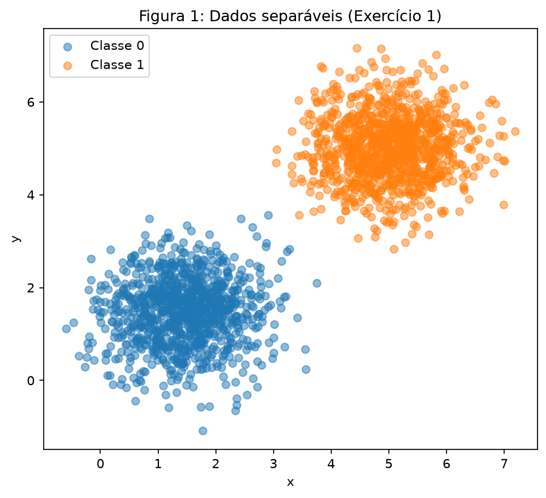
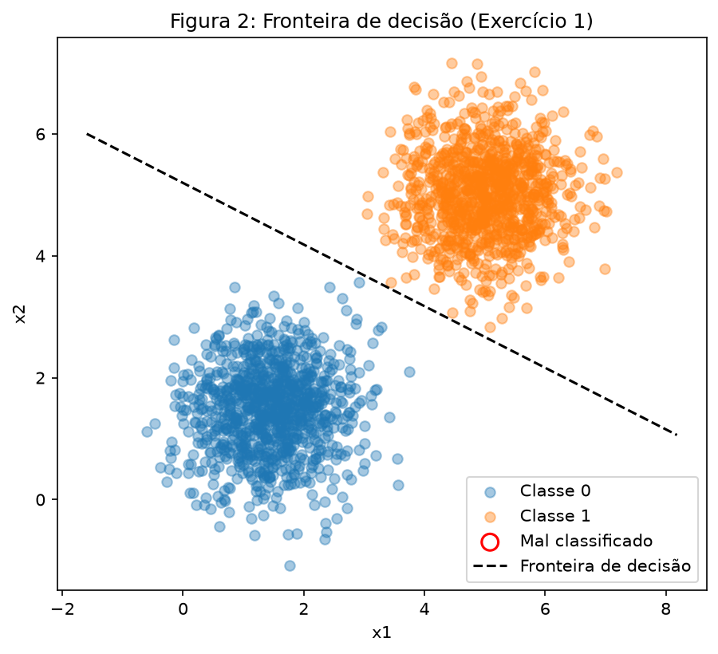
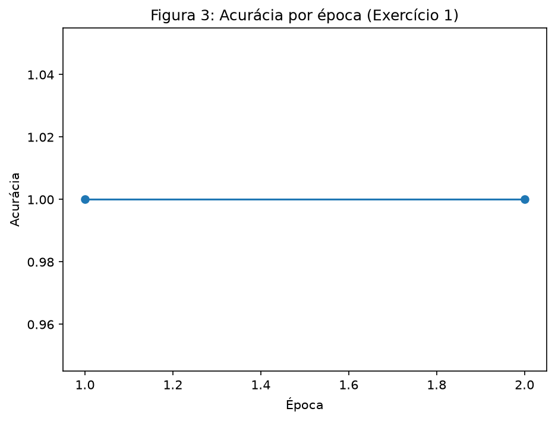
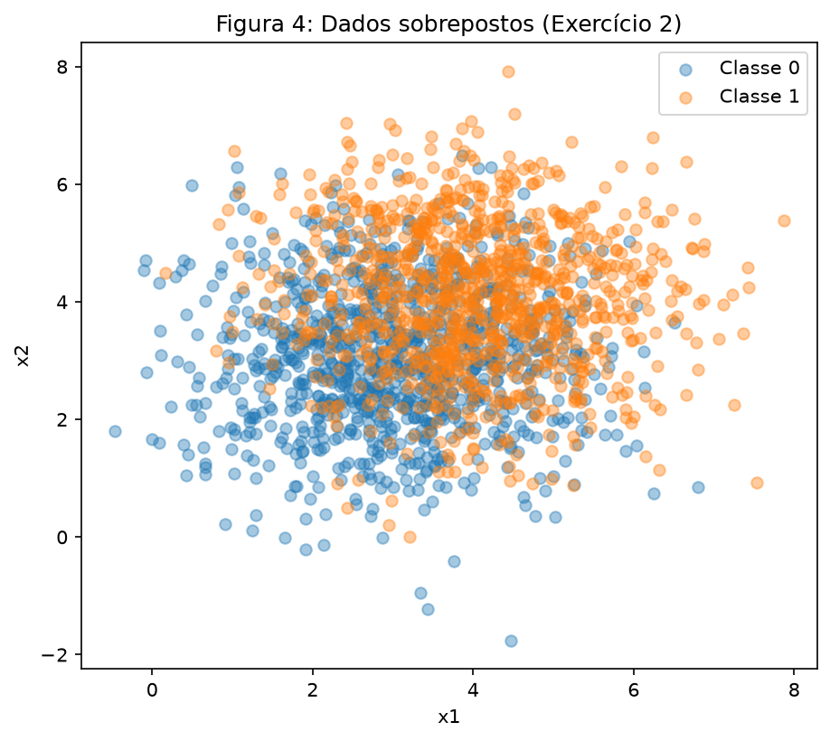
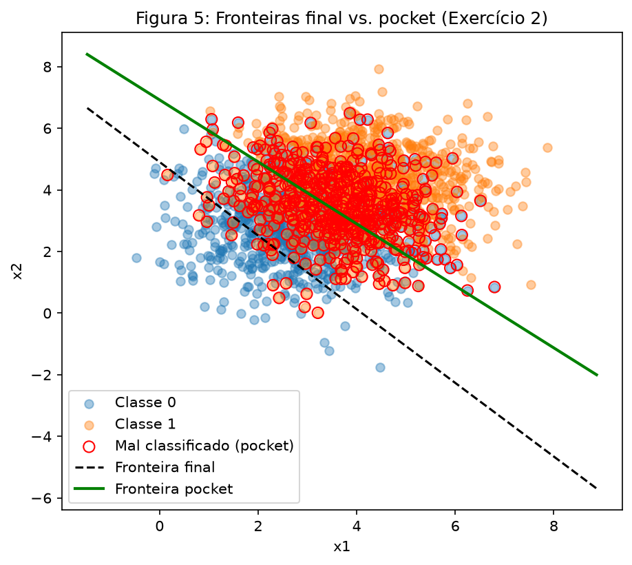
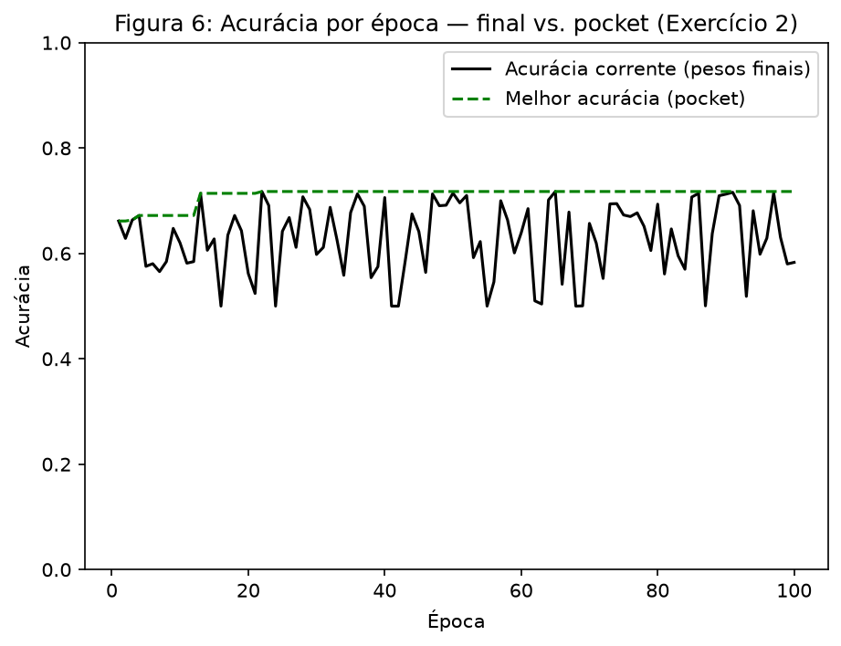

# Atividade: Perceptron

!!! info "Uso de Inteligência Artificial"
    Utilizei o Claude como assistente de orientação ao longo deste exercício: ele explicou os conceitos envolvidos, revisou minha lógica e me ajudou a organizar o código e a estrutura do relatório. Toda a implementação, execução dos experimentos e interpretação dos resultados foi feita por mim.

!!! info "Método de resolução"
    O desenvolvimento deste exercício foi separado em dois arquivos: este relatório (`index.md`) e o `code/perceptron.py`, onde está o passo a passo de todas as implementações e experimentos.

### A) Gerando os Dados
Foram geradas duas classes de pontos 2D, 1000 amostras por classe, a partir de distribuições normais multivariadas:

| Classe | Média | Covariancia |
|---|---|---|
| 0 | (1.5, 1.5) | [[(0.5, 0)], [(0, 0.5)]] |
| 1 | (5, 5) | [[(0.5, 0)], [(0, 0.5)]] |

--8<-- "code/perceptron.py:ex1-dados"

### B) Implementação do Perceptron

O perceptron foi implementado do zero (função `treinar_perceptron`):

- **Predição:** ŷ = degrau(w·x + b), onde degrau(z) = 1 se z ≥ 0, senão 0.
- **Regra de atualização:** w ← w + η(y−ŷ)x ; b ← b + η(y−ŷ).
- **Inicialização:** w ~ N(0, 0.01², tamanho 2); b = 0. Pesos não começam exatamente em zero porque, em w=0 exato, a primeira previsão para todos os pontos é idêntica (degrau(0)=1) — um início pequeno e aleatório evita esse artefato sem alterar o comportamento assintótico do algoritmo.
- **Critério de parada:** uma passada completa pelos dados, época, sem nenhuma atualização, ou 100 épocas.
- **Importante:** os dados são embaralhados a cada época (`rng.permutation`). Sem isso, o perceptron processa sempre a Classe 0 inteira antes da Classe 1, o que distorce o aprendizado (a rede "esquece" os primeiros exemplos enquanto ainda está vendo só uma classe). -> Esse conhecimento foi percebido ao final do exercício 2, o código py ainda contém as duas funções elaboradas por mais que uma tenha sido comentada a final.

--8<-- "code/perceptron.py:perceptron-treino"

### C) Treinamento e Resultados

Com η = 0.01 e máximo de 100 épocas:

| Métrica | Valor |
|---|---|
| w final | [0.00778, 0.01540] |
| b final | -0.08 |
| Épocas até convergência | 2 |
| Acurácia final | 100% |

### D) Análise

**D.1: Por que dados separáveis convergem rápido?**

Os dados separáveis convergem rápido dado que como ambas as nuvens de pontos estão bem longes uma da outra e são pouco espelhadas, quando o perceptron inicia seu processo e corrige um ponto errado (da fronteira de decisão que era inicialmente aleatória), esse ajuste auxilia na correção de diversos pontos vizinhos, devido a sua proximidade e aglomeração de pontos. De forma que, corrigir um erro, em cenários de dados separáveis, já corrige diversos outros pontos similares. É por isso que a primeira época ainda apresenta muitas correções (dado a fronteira aleatória e "errada") e, a partir da segunda época já tem uma diferença discrepante e muitos acertos, sem erros para corrigir - fazendo o erro parar com poucas épocas até convergência.

**D.2: Rerun com η = 1.0**

| Métrica | η = 0.01 | η = 1.0 |
|---|---|---|
| w final | [0.00778, 0.01540] | [5.358, 5.551] |
| b final | -0.08 | -36.0 |
| Épocas até convergência | 2 | 5 |
| Acurácia final | 100% | 100% |

A acurácia final é idêntica (100%) e a similaridade de cosseno entre as duas direções de w é **0.9554**, de forma que as duas execuções convergem para praticamente a mesma fronteira de decisão, apesar de ‖w‖ ser BEM maior no caso η=1.0. Isso mostra que η, a taxa de aprendizado, realmente controla o tamanho do passo de cada atualização, não a direção final da fronteira. Tal afirmação auxilia no pensamento que um η grande demais em problemas mais difíceis pode causar oscilação, que nesse caso, como a margem é folgada, apenas acelera a convergência (5 épocas mesmo dando passos gigantes) sem prejudicar o resultado.

**D.3: Argumento algébrico (w₀=0, b₀=0)**

Partindo de w=0, b=0, a primeira previsão para qualquer ponto é degrau(0)=1, e isso não depende de η, a taxa de aprendizado ainda nem entrou. Isso significa que o padrão de acertos e erros na primeira passada pelos dados seria idêntico não importa o η escolhido.

A partir daí, cada atualização é w ← w + η·erro·x, onde erro só pode ser -1, 0 ou +1 (a diferença entre rótulo real e previsto). Como η é sempre positivo, ele nunca troca o sinal da atualização, só o tamanho do passo. Ou seja, a decisão de que pra que lado mexer é sempre a mesma, para qualquer η, só o tamanho do passo que realmente muda. E como essa decisão é sempre igual, o próximo ponto testado também vai dar o mesmo resultado (certo ou errado) não importa o η. Rodando o treino duas vezes a partir de w=0, com η1 e η2, mas vendo os mesmos pontos na mesma ordem, as duas execuções tomam exatamente as mesmas decisões do primeiro ao último passo.

Como cada peso final é só a soma de todos os passos dados ao longo do treino, e cada passo tem sempre o formato "η vezes a mesma correção", dá pra tirar o η pra fora da soma inteira:

w_final = η · Σ(correções) = η · S

onde (S) é essa soma de correções, que é idêntica nas duas execuções (porque as decisões foram idênticas). O mesmo vale para b. Dessa forma, comparando as duas execuções completas:

w(η₂) = (η₂ / η₁) · w(η₁)

b(η₂) = (η₂ / η₁) · b(η₁)

ou seja, os pesos finais diferem só por um fator de escala constante, η₂/η₁.

Isso tem uma consequência mais forte do que só "a direção de w é a mesma": como w e b escalam pelo mesmo fator, a fronteira de decisão w·x+b=0 é literalmente idêntica nas duas execuções e multiplicar toda a equação por uma constante positiva não muda quais pontos satisfazem w·x+b=0. Como as decisões tomadas a cada passo também são idênticas, o número de épocas até parar (quando uma época inteira passa sem nenhuma atualização) também é exatamente o mesmo. Partindo de zero, η não teria efeito nenhum no resultado final, ele só mudaria a escala numérica de w e b.

É exatamente por isso que o item B não permite começar de w=0, se começassem, η não mudaria nada e ficaria tudo idêntico. Ao inicializar com um w₀ pequeno e aleatório em vez de zero, essa proporcionalidade perfeita deixa de valer (a trajetória pode, tomar uma decisão diferente entre as duas execuções), abrindo espaço pra η ter um efeito como as 2 épocas de η=0,01 viram 5 com η=1,0, e o cosseno entre as direções cai de 1,0 exato pra 0,9554.

---

## **Ex 2: Dados Sobrepostos**

### A) Gerando os Dados

Gerando duas classes de pontos 2D, 1000 amostras por classe com as médias próximas e o espalhamento três vezes maior, então as nuvens se sobrepõem bastante e nenhuma reta as separa.

| Classe | Média | Covariancia |
|---|---|---|
| 0 | (3, 3) | [[(1.5, 0)], [(0, 1.5)]] |
| 1 | (4, 4) | [[(1.5, 0)], [(0, 1.5)]] |

--8<-- "code/perceptron.py:ex2-dados"

### B) Treinamento com Pocket

Reaproveitando a mesma função e implementação do Exercício 1 (η=0.01, 100 épocas), guardando também os pesos (melhor acurácia vista ao longo do treino):

| Métrica | Pesos finais | Pesos pocket |
|---|---|---|
| w | [0.1218, 0.1019] | [0.0683, 0.0679] |
| b | -0.50 | -0.47 |
| Acurácia | 58.3% | 71.75% |

O treino rodou as 100 épocas completas sem convergir (esperado dado que os dados não são linearmente separáveis). O pocket atingiu seu melhor valor na **época 22** e permaneceu lá até o final.

### C) Figuras

Produzindo duas figuras:

Figura 5 a respeito das fronteiras de decisão (final e pocket) e sinalizando os mal classificados. 

Figura 6 das curvas contra a época, verificando a acurácia dos pesos atuais e a melhor entre elas (pocket).

Essas figuras facilitam a visualização da diferença entre os dados separáveis e não separáveis, onde a contagem e visualizaçãos dos pontos mal classificados são evidentes. As médias próximas e alto espalhamento geram essa dificuldade de definição de fronteira e obtenção de acurácia boa.

### D) Análise

**D.1: Diferença entre acurácia final e pocket; onde fica a fronteira final e por quê**

Como as duas nuvens se sobrepõem, não existe fronteira que separe os dados perfeitamente, de modo que o perceptron nunca "para" de verdade, fica reajustando os pesos indefinidamente. A acurácia final (58,3%) é só o retrato da época 100, um ponto qualquer de uma trajetória que oscila entre ~50% e ~72% (Figura 6). O pocket (71,75%) guarda o melhor retrato entre todas as 100 épocas, evitando o azar de parar num momento ruim.

O porquê está na comparação sugerida pelo enunciado, quanto b se move por erro vs. quanto w se move. A cada erro, b muda por ±η = ±0,01 (passo fixo, pequeno). Já w muda por ±η·x, e aqui x tem componentes em torno de 3–4 (a nuvem de pontos está longe da origem, centrada em [3,3]–[4,4]), ou seja, o passo efetivo de w por erro é bem maior que o de b. Isso faz w convergir rápido para a orientação correta: a similaridade de cosseno entre w_final e w_pocket é **0,996**, sendo praticamente a mesma direção de fronteira (inclinação ≈ -1,20 no final contra ≈ -1,01 no pocket, ambas próximas da fronteira teórica, que tem inclinação exata -1). O problema é a posição da fronteira, controlada pela razão -b/‖w‖ (distância da origem até a fronteira, na direção de w): no pocket essa distância é 4,88, sendo quase a distância certa da origem até o centro do overlap em (3,5, 3,5), que é quase 5. No final, essa distância cai para 3,15, meio como se a fronteira tivesse "encolhido" de volta pra perto da origem, cortando a nuvem da Classe 0 em vez de passar pelo meio. 

Como b se move em passos pequenos e fixos, ele "demora" a alcançar (e não fica garantido que mantenha) o deslocamento necessário, enquanto w já se estabilizou na direção certa, aí a fronteira final tem a inclinação praticamente certa mas a posição errada.

**D.2: Comparação Figura 3 x Figura 6: o que o teorema de convergência garante; qual hipótese é violada**

O teorema de convergência do perceptron garante que, se os dados forem linearmente separáveis, o algoritmo encontra uma fronteira com erro zero em um número finito de passos. A Figura 3 (Exercício 1) mostra exatamente esse comportamento, de que a acurácia sobe e estabiliza em 100% após 2 épocas, permanecendo lá, uma condição de parada satisfeita, sem mais updates. A Figura 6 (Exercício 2) nunca estabiliza: a curva de acurácia oscila indefinidamente pelas 100 épocas, sem nunca atingir um patamar fixo. Isso acontece porque o Exercício 2 viola a hipótese central do teorema de separabilidade linear. As duas nuvens se sobrepõem, então não existe nenhum w,b que classifique 100% dos pontos corretamente, sempre existirão pontos mal classificados empurrando os pesos para uma nova atualização, e a garantia de convergência simplesmente não se aplica.

**D.3: Mais épocas resolve? η menor resolve?**

Não, nem acrescentar mais épocas nem diminuir a taxa de aprendizado resolvem. 

Isso pode ser justificado diretamente pela regra de atualização, sem precisar testar. O perceptron só para de atualizar quando uma época inteira passa sem nenhum erro, e como os dados não são linearmente separáveis, sempre existirá pelo menos um ponto no lado errado da fronteira, para qualquer w e b. Rodar mais épocas apenas dá mais chances de a trajetória passar por um ponto de acurácia melhor, mas não corrige a causa raiz, e o pocket já captura o melhor caso visto sem precisar disso. 

Diminuir η também não ajuda: η é só um fator de escala no tamanho do passo (D.2/D.3 do Ex 1 mostraram que ele não muda a direção da fronteira, só a magnitude de w e b), ou seja, um η menor deixa a trajetória mais "suave" e lenta, mas ainda vai continuar oscilando para sempre em torno da mesma região, porque o core do problema de dados sobrepostos, sem separação possível, não muda. A única forma de melhorar seria mudar o modelo.

---

## Tabela-Resumo

| Item | Valor |
|---|---|
| Ex 1 — w final (η=0.01) | [0.00778, 0.01540] |
| Ex 1 — b final (η=0.01) | -0.08 |
| Ex 1 — épocas até convergência (η=0.01) | 2 |
| Ex 1 — acurácia final (η=0.01) | 100% |
| Ex 1 — w final (η=1.0) | [5.358, 5.551] |
| Ex 1 — b final (η=1.0) | -36.0 |
| Ex 1 — épocas até convergência (η=1.0) | 5 |
| Ex 1 — acurácia final (η=1.0) | 100% |
| Ex 2 — w final | [0.1218, 0.1019] |
| Ex 2 — b final | -0.50 |
| Ex 2 — acurácia final | 58.3% |
| Ex 2 — w pocket | [0.0683, 0.0679] |
| Ex 2 — b pocket | -0.47 |
| Ex 2 — acurácia pocket | 71.75% |
| Ex 2 — época do melhor pocket | 22 |
| Ex 2 — épocas rodadas | 100 (não convergiu) |